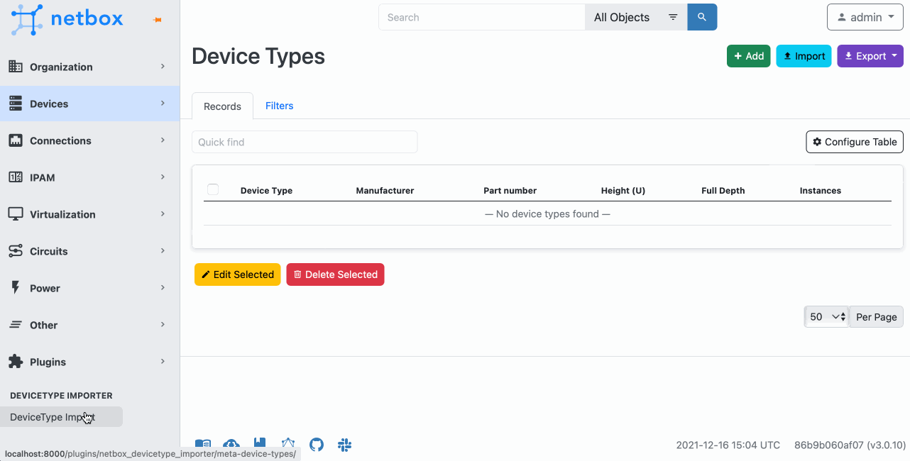

# Netbox DeviceType Import Plugin
[NetBox](https://github.com/netbox-community/netbox) plugin for easy import DeviceType from [NetBox Device Type Library](https://github.com/netbox-community/devicetype-library)

## Description
The plugin uses [GitHub GraphQL API](https://docs.github.com/en/graphql) to load DeviceType from [NetBox Device Type Library](https://github.com/netbox-community/devicetype-library). The plugin loads only file tree representation from github repo and shows it as a table with vendor and model columns. DeviceType definitions files are loaded when you try to import selected models.
To use GraphQL API you need to set GitHub personal access token in plugin settings. How to create the token, see ["Creating a personal access token."](https://docs.github.com/en/github/authenticating-to-github/creating-a-personal-access-token)

## Compatibility

This plugin in compatible with [NetBox](https://netbox.readthedocs.org/) 3.0

## Installation

The plugin is available as a Python package in pypi and can be installed with pip

```
pip install netbox-devicetype-importer
```
Enable the plugin in [NetBox Configuration](https://netbox.readthedocs.io/en/stable/configuration/)
```
PLUGINS = ['netbox_devicetype_importer']
```

## Configuration
Put your GitHub personal access token to [NetBox plugins config](https://netbox.readthedocs.io/en/stable/configuration/optional-settings/#plugins_config)
```
PLUGINS_CONFIG = {
    'netbox_devicetype_importer': {
        'github_token': '<YOUR-GITHUB-TOKEN>'
    }
}
```
## Screenshots

 

## Future 
* Import device images from GitHub repo
* Add a GitHub REST API client that allows this plugin to be used without the GitHub token
